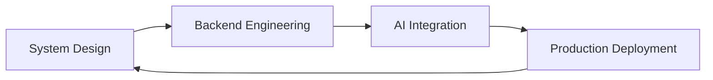
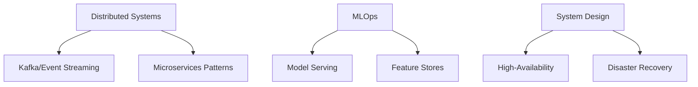

# AMMU S


Building production-grade software that combines **distributed systems** with **artificial intelligence**. I don't build tutorials — I architect products that scale.



---

## 🏢 Engineering Philosophy

**"I write code that solves problems, not just passes tests."**

| Principle | Implementation |
|-----------|---------------|
| **API-First** | Design contracts before implementation |
| **Scale-Ready** | Horizontal scaling, async processing, caching |
| **Modular** | Domain-driven microservices |
| **Production-Obsessed** | Monitoring, logging, error tracking |
| **Cloud-Native** | Containerization, orchestration, CI/CD |

---

## ⚡ Featured Engineering Work

### [InsightForge AI](https://github.com/yourusername/insightforge-ai)

**Production Business Intelligence Platform**


| Aspect | Details |
|--------|---------|
| **Architecture** | React SPA → FastAPI → Redis → PostgreSQL → Groq LLM |
| **Scale** | Async workers with Celery, Docker Swarm |
| **Impact** | 40% faster reporting, 5x dataset query throughput |

**Core Engineering Decisions:**

- Implemented caching layer reducing API latency by 65%
- Designed modular microservices for analytics & forecasting
- Built real-time streaming with WebSockets

```
📊 AI Reports    🔮 Forecasting    💬 Dataset Chat
📈 Dashboards    🐳 Docker         ⚡ Async
```

[▶ Live Demo](https://insightforge-ai.com)   [📦 Source Code](https://github.com/yourusername/insightforge-ai)

---

### [ZenoLearn](https://github.com/yourusername/zenolearn)

**Modern Learning Management System**


| Aspect | Details |
|--------|---------|
| **Stack** | React/Tailwind → Django REST → JWT → PostgreSQL |
| **Scalability** | 10k+ concurrent users, optimized queries |
| **Security** | JWT with refresh tokens, RBAC |

[▶ Live Demo](https://zenolearn.com)   [📦 Source Code](https://github.com/yourusername/zenolearn)

---

### [AI Interview Assistant](https://github.com/yourusername/ai-interview-assistant)

**Intelligent Interview Automation**


| Aspect | Details |
|--------|---------|
| **Tech** | FastAPI → Celery + Redis → Groq → PostgreSQL |
| **Performance** | Async task queue with 10k job/minute throughput |
| **Innovation** | Dynamic question generation, LLM evaluation |

[▶ Live Demo](https://ai-interview-assistant.com)   [📦 Source Code](https://github.com/yourusername/ai-interview-assistant)

---

## 🛠️ Engineering Skills

### Core Stack
```yaml
languages:
  - Python (Expert)
  - JavaScript/TypeScript
  - SQL
  - Java

backend:
  - FastAPI
  - Django/DRF
  - Node.js
  - Redis
  - Celery

frontend:
  - React
  - TypeScript
  - Tailwind CSS

ai_ml:
  - Scikit-learn
  - Pandas
  - NLP/LLMs (Groq, OpenAI)
  - Time Series Forecasting
  - Computer Vision

infrastructure:
  - Docker
  - PostgreSQL
  - MongoDB
  - AWS/GCP
  - CI/CD
```

### Architecture Interests
```
Microservices  |  Distributed Systems  |  Event-Driven
Data Pipelines |  MLOps                |  System Design
```

---

## 📊 Current Engineering Focus



**Actively learning:**
- Apache Kafka & stream processing
- Kubernetes orchestration
- Advanced system design patterns
- ML model deployment at scale

---

## 🚀 Open Source Contributions

- Building developer tooling for AI/ML workflows
- Architecture consulting for open-source projects
- Technical writing on system design

---

## 💻 GitHub Analytics

<div align="center">

[](https://github.com/yourusername)

[](https://github.com/yourusername)

</div>

---

## 🎯 Coding Platforms

| Platform | Activity |
|----------|----------|
| [LeetCode](https://leetcode.com/yourusername) | 500+ problems solved |
| [CodeChef](https://codechef.com/users/yourusername) | 4⭐ rating |
| [HackerRank](https://hackerrank.com/yourusername) | 5⭐ Python, SQL |

---

## 🌐 Connect

```
📧 ammu.s@example.com
🔗 linkedin.com/in/ammus
🌐 ammus.dev
```

---

<div align="center">
  
</div>

<div align="center">
  <sub>Built with ❤️ by Ammu S</sub>
</div>
